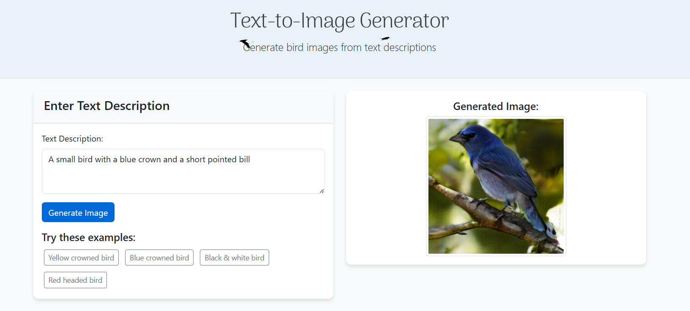

# Bird Text-to-Image Generation Web Application

This project is a web application that generates bird images from textual descriptions using the DF-GAN architecture. The application provides a simple web interface where users can enter descriptions of birds, and the system will generate corresponding images.

## Overview

This application uses a pre-trained DF-GAN model to generate realistic bird images based on text descriptions. The system consists of:

1. A Flask web server that handles user requests
2. A text encoder that converts textual descriptions into embeddings
3. A generator model that creates images from these embeddings
4. A simple web interface for user interaction

## Features

- Text-to-image generation for bird descriptions
- Real-time image generation in the browser
- Automatic model loading and verification
- User-friendly error handling and instructions

## Technical Details

The application uses several key components:

- **Flask**: Web framework for handling HTTP requests
- **PyTorch**: Deep learning framework for running the models
- **DF-GAN**: Deep Fusion Generative Adversarial Network architecture
- **DAMSM**: Deep Attentional Multimodal Similarity Model for text encoding

## How It Works

1. The user enters a textual description of a bird
2. The text is tokenized and converted into embeddings using the text encoder
3. The generator model takes these embeddings and random noise as input
4. The generator produces an image that matches the description
5. The image is sent back to the user's browser

## Required Model Files

Due to GitHub's file size limitations, the model files are not included in this repository. Please download the following files and place them in the correct directories:

1. Generator model (`state_epoch_1220.pth`) → `Code/saved_models/birds/pretrained/`

## User Interface Example

Below is a screenshot of the web application interface where users can enter text descriptions and view the generated bird images:

The interface provides a simple text input field for entering bird descriptions and displays the generated image once processing is complete.

## Setup and Installation

1. Clone this repository
2. Download the required model files (see above)
3. Install the required dependencies: `pip install -r requirements.txt`
4. Run the application: `python app.py`
5. Open a web browser and navigate to `http://localhost:5000`

## Usage

1. Enter a description of a bird in the text box (e.g., "a bird with a red head and blue wings")
2. Click the "Generate" button
3. Wait for the image to be generated and displayed

## Acknowledgments

This project builds upon the DF-GAN architecture developed by Ming Tao, Hao Tang, Fei Wu, Xiao-Yuan Jing, Bing-Kun Bao, and Changsheng Xu. The original research paper "DF-GAN: Deep Fusion Generative Adversarial Networks for Text-to-Image Synthesis" can be found at [https://arxiv.org/abs/2008.05865](https://arxiv.org/abs/2008.05865). The implementation has been adapted and extended to create a web-based interface for easier interaction with the model.